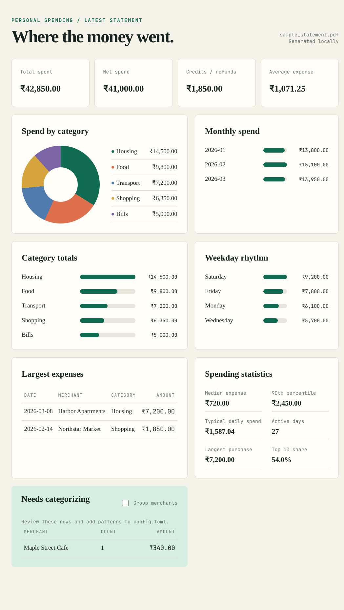

# Google Pay Analytics

Turn a Google Pay transaction statement into a clear picture of your spending.

Google Pay Analytics is a local-first Python tool that reads the newest Google Pay statement PDF in a folder, maps merchants to categories from `config.toml`, and builds a standalone dashboard you can open in a browser. Your financial data stays on your machine: there is no account connection, cloud upload, database, or external analytics service.



> The dashboard image above uses fictional sample data. It is included only to show the layout and does not contain anyone's real transactions.

## What It Produces

Every run creates three files in `reports/`:

- **Dashboard (`.html`)**: an offline visual summary with spending cards, a category donut chart, monthly and weekday charts, largest expenses, and merchants that still need categorization.
- **Markdown report (`.md`)**: a readable summary that is easy to search or share.
- **JSON export (`.json`)**: every parsed transaction plus calculated aggregates for further analysis.

The analysis covers total expenses, credits and refunds, net spend, average expense, category shares, monthly totals, weekday patterns, top merchants, largest purchases, and uncategorized transactions.

## Get a Statement From Google Pay

To download a statement from the Google Pay app:

1. Open **Google Pay**.
2. Go to **Transactions**.
3. Tap the **three-dot menu** in the transactions area.
4. Choose the option to get or download your **statement**.
5. Select the period you want and save the PDF into this project folder.

The wording can vary slightly by app version and region. The parser is built for the Google Pay transaction statement format. The PDF needs selectable text; an image-only scan must be made searchable with OCR first.

## Quick Start

From the project folder:

```sh
python3 -m venv .venv
.venv/bin/pip install -e '.[dev]'
cp config.toml.example config.toml
.venv/bin/gpay-analytics
```

Before running the parser, create your local `config.toml` from `config.toml.example` and add your own merchant-to-category mappings. `config.toml` is intentionally ignored by Git because it is personal configuration. The command automatically chooses the newest `*.pdf` by modification time. Older statements can remain in the folder; just add the latest PDF.

To choose another input or output location:

```sh
.venv/bin/gpay-analytics \
	--folder /path/to/statements \
	--config /path/to/config.toml \
	--output /path/to/reports
```

Open the generated `.html` file in `reports/` in a browser. It is a self-contained page and does not need a web server.

## Use the Small Website

For a simple local upload page, install the dependencies and run:

```sh
python3 web.py
```

Open `http://127.0.0.1:5000`, upload a Google Pay PDF, and the site will show the same dashboard generated by the command-line script. The uploaded file is processed from a temporary folder and is not saved by the website.

## Configure Categories

Categories live in [`config.toml`](config.toml). Each category contains case-insensitive text patterns. If a merchant description contains a pattern, it is assigned to that category.

```toml
[categories]
Food = ["swiggy", "zomato", "restaurant", "cafe"]
Transport = ["uber", "ola", "metro"]
Housing = ["rent", "hostel"]

[parser]
credit_keywords = ["refund", "cashback", "received", "reversal"]
```

Unmatched expenses are placed in `Uncategorized` rather than silently guessed. Add a merchant pattern, run the command again, and the dashboard will refresh. A portable starter file is available at [`config.toml.example`](config.toml.example).

## How It Works

1. Find the newest PDF in the selected folder.
2. Extract its text using `pypdf`.
3. Fall back to the system `pdftotext` command when `pypdf` is unavailable.
4. Read Google Pay dates, merchant descriptions, amounts, and received payments.
5. Apply the mappings in `config.toml`.
6. Calculate summaries and write the dashboard, Markdown, and JSON files.

The parser does not retain data outside the generated files and does not need Google account credentials.

## Project Layout

```text
.
├── config.toml                 # Merchant-to-category mappings
├── config.toml.example         # Portable example configuration
├── src/gpay_analytics.py       # Parser, analysis, and report generation
├── tests/test_parser.py        # Parser and analysis tests
├── docs/dashboard-preview.png  # Fictional sample used in this README
└── reports/                    # Generated output for local statements
```

## Testing

```sh
python3 -m pytest
```

For a quick syntax check:

```sh
PYTHONPATH=src python3 -m py_compile src/gpay_analytics.py
```

## Troubleshooting

### No transactions detected

Make sure the newest PDF is a Google Pay transaction statement and that you can select or copy text from it. Scanned PDFs do not contain a text layer and need OCR first.

### A merchant is uncategorized

Add a distinctive part of its name to the right category in `config.toml`, then rerun the parser. Matching is case-insensitive substring matching.

### The wrong PDF was selected

The newest file by modification time wins. Move unrelated PDFs out of the folder or pass a dedicated folder with `--folder`.

## Privacy

This project is designed for personal financial data. It runs locally, does not call a remote API, and does not upload statements. Treat the generated JSON, reports, and original PDFs as sensitive files.